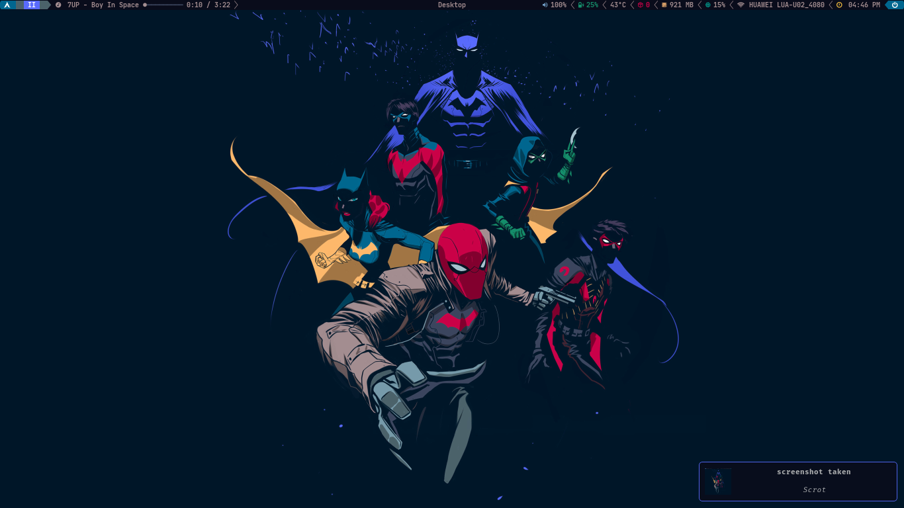
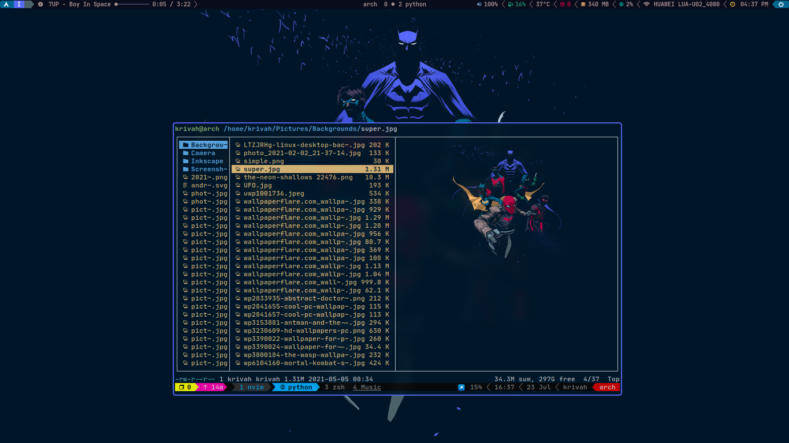
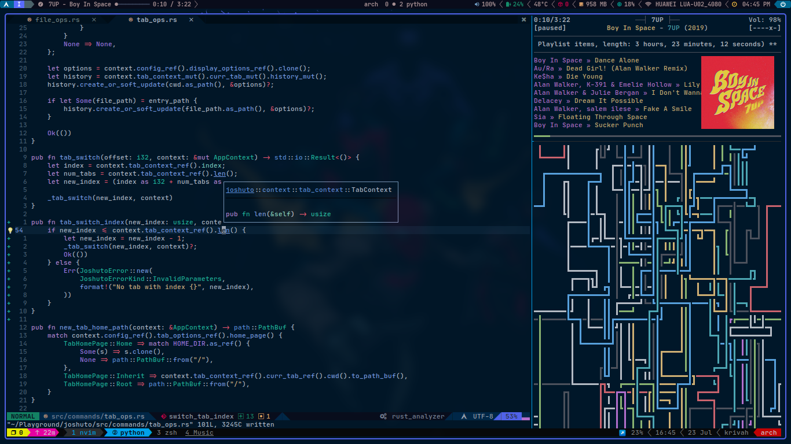

# Dotfiles

My Arch setup config managed using [stow](https://www.gnu.org/software/stow/)

Config for

- Nvim
- bspwm
- picom
- sxhkd
- ncmpcpp

## Screenshots




## Terminal look


## Setup
Clone this repo to `~/.dotfiles`

```sh
git clone https://github.com/krivahtoo/Dotfiles ~/.dotfiles
```

Then

```sh
cd ~/.dotfiles
# import config for each app using stow
# eg
stow nvim
```
