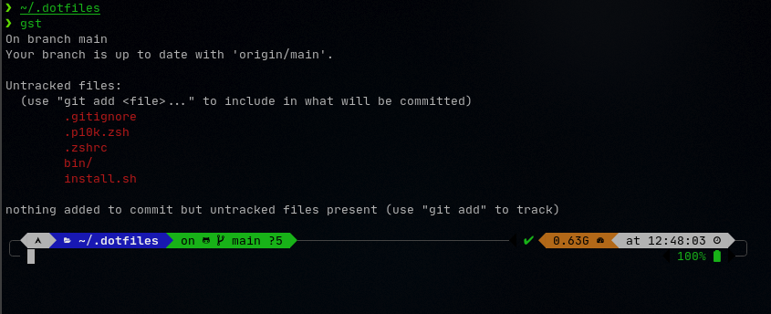

# Dotfiles

My Arch setup config

## Terminal look


## Setup
Clone this repo to `~/.dotfiles`

```sh
git clone https://github.com/krivahtoo/Dotfiles ~/.dotfiles
```

Then

```sh
cd ~/.dotfiles
./install.sh
```
